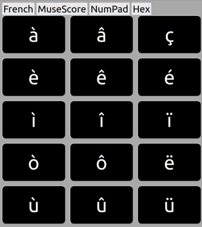
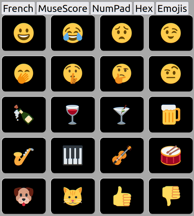

# Keypadder
Keypadder is a programmable virtual keypad for your Linux desktop that you can access via a mobile phone or tablet.





Keypadder runs on your desktop machine and provides a mobile/tablet-friendly web page that you use
from a tablet or phone to send frequently-used, awkward, or difficult-to-remember key combinations
to the currently-focused desktop application.

Amongst other things, the author uses it with Thunderbird and LibreOffice Writer for typing accented characters, with MuseScore to provide a keypad similar to commercial score writing application, and with Firefox for accented characters and Emojis in social media.

## Key Features

* Simple TOML definition for pads - examples provided
* Flexible layout possibilities to suit portrait or landscape modes
* Runs enitrely locally, no internet required, no JavaScript libraries
* Keytops can be strings &/or HTML entities eg. `&agrave;`
* No app required on phone/tablet - it uses the browser
* Keys can send multiple keystrokes, can use for macros

(Keypadder currently runs only on 64-bit Linux systems)

## Build and Install

A binary (.deb) version for 64-bit Debian-based systems *may* be available as part of a release.

### Build from Source
Keypadder is [hosted on GitHub](https://github.com/SMerrony/keypadder).
It is written entirely in GNU Ada (GNAT) and built using the [Alire](https://alire.ada.dev/) build system.

Until the Alire crate is available, you should download (or clone) the source from Github
and run `alr build` in the top-level directory.

***TODO  - Add more detail here once Alire crate is available***

## Running Keypadder
`keypadder -h` will give a list of all options. 
```
$ ./bin/keypadder -h
Usage of keypadder:
  <config-file>       Configuration file for keypadder (required to run)
  --dumpkeys          List all defined key mnemonics
  -h | --help         This help
  -V | --version      Show the version of keypadder and exit
  -v | --verbose      Show lots of detail when running
  ```

**Keypadder must be run with root privileges in order to inject keystrokes into your system.**

Eg: `sudo ./bin/keypadder examples/keypad.toml`

### Creating Your Own Keypads
See our [Configuration Guide](docs/ConfigurationGuide.md).
