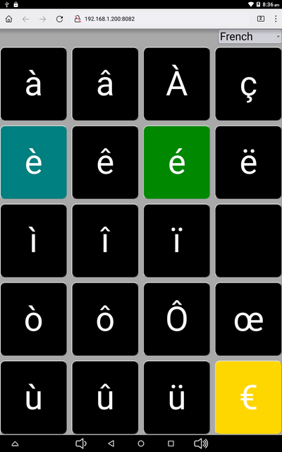
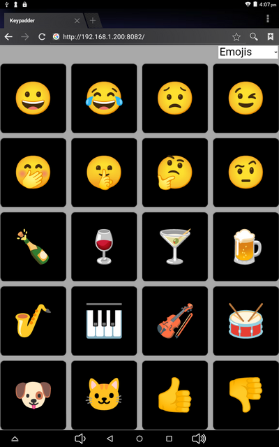
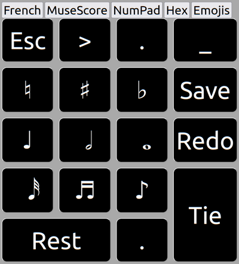

# Keypadder
Keypadder is a programmable virtual keypad for your Linux desktop that you can access via a mobile phone or tablet.





Keypadder runs on your desktop machine and provides a mobile/tablet-friendly web page that you use
from a tablet or phone to send frequently-used, awkward, or difficult-to-remember key combinations
to the currently-focused desktop application.

Amongst other things, the author uses it with Thunderbird and LibreOffice Writer for typing accented characters, with MuseScore to provide a keypad similar to a certain commercial score writing application, and with Firefox for accented characters and Emojis in social media.

It's a great use for one of those old smartphones or tablets you have lying in that drawer!

## Key Features

* Simple TOML definition for pads - examples provided
* Flexible layout possibilities to suit portrait or landscape modes
* Runs enitrely locally, no internet required, no JavaScript libraries
* Keytops can be strings &/or HTML entities eg. `&agrave;`
* No app required on phone/tablet - it uses the browser
* Keys can send multiple keystrokes, can use for macros

(Keypadder currently runs only on 64-bit Linux systems)

## Build and Install

A binary (.deb) version for modern 64-bit Debian-based systems *may* be available as part of a release.

The Keypadder source is [hosted on GitHub](https://github.com/SMerrony/keypadder).

It is written entirely in GNU Ada (GNAT).  You may build it using either the [Alire](https://alire.ada.dev/) build system or plain old `gprbuild`.  
Building via Alire is preferred where it is possible as all necessary dependencies will be obtained for you automatically.

### Alire Build

Until the Alire crate is available, you should download (or clone) the source from Github
and run `alr build` in the top-level directory.

***TODO  - Add more detail here once Alire crate is available***

### Gprbuild Build

#### Prerequisites
You should the development version of `libaws` via your package manager.
You will also need `ada-toml` from https://github.com/pmderodat/ada-toml - follow the instructions there to install it.

Then...

```
mkdir obj
gprbuild -Pnon_alire
```

## Running Keypadder

You need to start Keypadder on your desktop machine,
then browse to the web page it provides on your mobile device.

Once it is running you use the desktop as normal and can use a keypad to insert keystrokes
into the currently-focused window.

### On the Desktop

`keypadder -h` will give a list of all options. 
```
$ ./bin/keypadder -h
Usage of keypadder:
  <config-file>       Configuration file for keypadder (required to run)
  --dumpkeys          List all defined key mnemonics
  -h | --help         This help
  -V | --version      Show the version of keypadder and exit
  -v | --verbose      Show lots of detail when running
  ```

**N.B. Keypadder must be run with root privileges in order to inject keystrokes into your system.**

Eg: `sudo ./bin/keypadder examples/keypad.toml`

### On the Phone/Tablet

With a browser, navigate to `http://<ip addr of desktop>:<port configured>/`

Eg: `http://192.168.1.200:8082/`

If your desktop has a name on your LAN, you can use it in place of the IP address.

Eg: `http//stevedesktop.lan:8082/`

## Creating Your Own Keypads
See our [Configuration Guide](docs/ConfigurationGuide.md).
